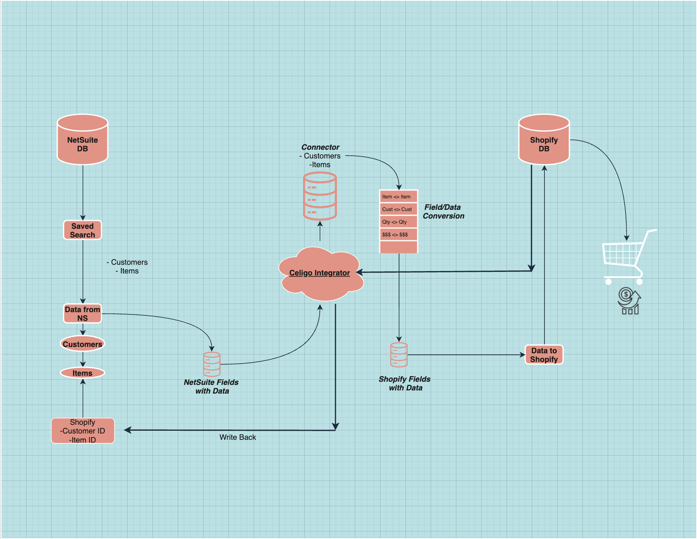

# Customers (Export to Shopify)
### CBC Specialty Beverage

When creating **New** customers or editing _existing_ _customers_ it is important to verify and fill a few NetSuite fields required in order to export customers to Shopify. It is possible to encounter customers that only exist in NetSuite and not in Shopify but never the other way around. 

### How does it work?

The integrator/connector relies on a list of data that is given from a NetSuite saved search, the connector runs on user action (click of a button) or on a scheduled basis. In our case we have this connector set to run on the following schedule:

```
(GMT-06:00) Central Time (US & Canada)
Frequency: Twice Daily
Start Time: 5:10 AM
End Time: 5:10 PM
Runs on these days: Monday, Tuesday, Wednesday, Thursday, Friday, Saturday, Sunday.
```

**Please note: This may change at any time.**

## Customer Criteria (Must):

- Email Address: _Not_ _Empty_

- Customer must be: **Active**

- Status: Customer-Sales Action, Customer-Won (Please send J.C. an email if we need to list additional status.)

## Important Customer Fields:

_Found under the **eTail** subtab in NetSuite_

- Etail Customer Exported:  _Unchecked_
- Shopify Stores: **CBC Specialty Beverage**
- Default Billing Address: ✅ (must have biling address)


## Main Process:

- NetSuite Saved Search:
    ``` Celigo Shopify Customer Export  [CBC Specialty Beverage]```
    -   Note: Please Do Not Make Any Changes to the Saved Search :)
- Meeting the all the criteria and having the fields correctly will result in the item being listed under the _Customer_ _Export_ saved search. 
- Everyday at 5:10 AM & 5:10 PM, the customer will be exported to Shopify and it only takes 2-3 minutes before it shows up in the store. 

If you run into any issues and the customer does not show up in Shopify after following all the instructions please send an email to jromualdo@cbcbev.com

### Diagram:



