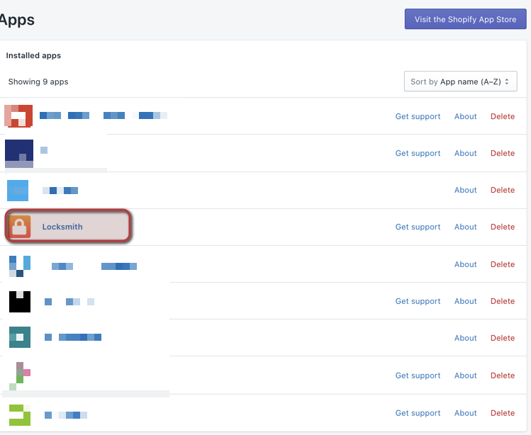
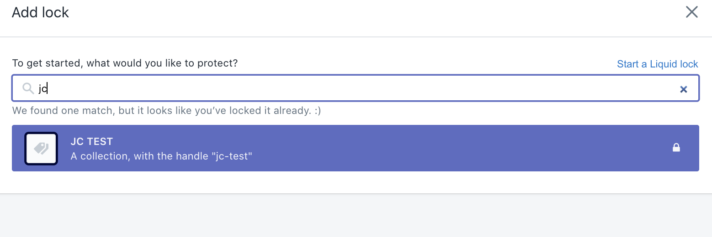

# Locking Collections (Shopify)
### CBC Specialty Beverage

######The process of locking collections:

After creating a collection [Create Collections](./createCollections.md) in Shopify we need to make sure that the collection will only be visible to that customer for which it has been created. 

To address this process we are using an application in the Shopify market called, Locksmith. Natively this is used to block customers from viewing information, pages, products and even pricing in some cases. 

Common case for CBC, we re-purposed the application and we are blocking each and every customer from seeing all products we offer online. Each sales representative holds a list of products that each customer can purchase from us and that same list is upload to Shopify, called a (collection) and that specific collection is only visible to that account/customer. 

#### Instructions:

###### Shopify Admin

- Navigate to Apps

- Click on - Locksmith - 

- +Add Lock
    - Look up the collection you wish to Lock (commonly named with the account/customer's name)

    

- Lock logic
    - Settings:
        ✅  Enable this lock - (this enables the lock on the collection)
        ✅  Hide any links to this collection (Hides any links, urls that would allow visibility)
        ✅  Hide this collection (Hides the collection from the entire store)

    - Keys:
        LOGIC:
            - Permit if the customer is tagged with (customer_name, company_name, account_name)
            (This is the logic where we define which customer can see this collection)

    