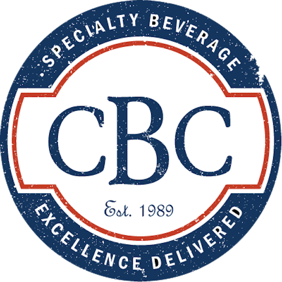

# Saved Searches & Pages (Celigo Connector)
### CBC Specialty Beverage

Celigo/NetSuite/Shopify integration comes packed with multiple saved searches to assist us in tracking data and other important aspects of the integration.

These saved searches are system or user created and will always have a prefixed text to identify and easily find what you are looking for.

```Celigo Shopify ```

Currently we count with at least **38 results** between saved searches and pages in NetSuite. It is recommended to only use these saved searches as templates and starting points to create new ones with custom naming convention and make modifications with additional data.

Search for: **_Celigo_ _Shopify_...** (wildcard to start a search)

### Some Important Saved Searches:

This is a small list of the common saved searches we have used during and after the integration of this technology:

- Celigo Shopify Customer Export  [CBC Specialty Beverage]
- Celigo Shopify Item Export  [CBC Specialty Beverage]
- Shopify WHOLESALE Orders


##### Saved Search List:


##### Pages List:


If you need to track specific data not pre-designed in this process please contact Matt or JC to further assist. 

CBC Specialty Beverage.

